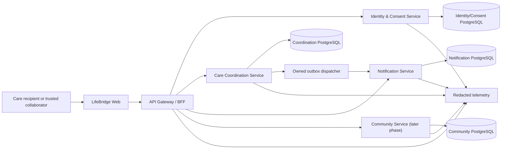

# LifeBridge Architecture

## Document status

- Architecture baseline: `ARCH-2026-07-25`
- Status: Accepted Phase 0 target architecture
- Runtime implementation status: P2-S1 backend candidate; production UI blocked
- Current phase: P2 — Trust and household
- Active implementation slice: `P2-S1`
- Production-maturity plan: `PLAN-2026-07-26-PRODUCTION` (`P0`–`P12`)

“Planned” below describes the approved target. “Actual” records repository/runtime evidence. Update both when implementation differs; do not rewrite the plan retroactively.

## 1. Architectural drivers

1. Deliver one reliable, user-visible vertical slice before broad platform scope.
2. Enforce household, role, and consent boundaries without a shared database shortcut.
3. Keep task completion durable even when notification delivery is delayed.
4. Run a deterministic synthetic demo without private credentials.
5. Support Windows bootstrap, test, build, and fresh-worktree reproduction.
6. Keep polyglot microservice boundaries practical for a small team while remaining independently runnable and deployable.
7. Make accessibility, privacy, auditability, and truthful state part of each contract.
8. Avoid operational complexity unless an access pattern proves it is needed.

## 2. Planned system context



No arrow represents direct access to another service's tables. The BFF composes APIs; it does not own domain records.

## 3. Planned versus actual

| Area                   | Planned baseline                                                         | Actual evidence at Phase 0                            |
| ---------------------- | ------------------------------------------------------------------------ | ----------------------------------------------------- |
| Workspace              | Polyglot microservice repository; runtime tooling is boundary-owned      | Node.js/pnpm services exist; no Java files/toolchain  |
| Web                    | Next.js + React, semantic components, localization                       | VI/EN routes and Stitch-derived states implemented    |
| Gateway/BFF            | Fastify, external HTTP contract, response composition                    | Public forwarding and honest degradation implemented  |
| Domain services        | Independently runnable, boundary-owned runtime artifacts                 | Node Gateway, Identity, Care and Notification exist   |
| Contracts              | Language-neutral OpenAPI/JSON Schema; versioned event envelope           | Executable TypeScript/Zod P1/P2 schemas exist         |
| Persistence            | PostgreSQL, separately owned database/schema per service                 | Two local/CI owner databases selected; migrations due |
| Cross-service delivery | Transactional outbox + versioned internal delivery + inbox/deduplication | Completion outbox/HTTP retry/inbox implemented        |
| Testing                | Vitest unit/contract/integration; Playwright browser smoke               | P1 Level C command and exact-head CI specified        |
| UI design              | Google Stitch MCP reference + reviewed repository handoff                | P1-S1 handoff frozen after native correction mapping  |
| Deployment             | Containerized services with health/readiness checks                      | Deferred until deployable slices exist                |

Any divergence requires a Change ID and, when architectural, an ADR.

### Accepted future polyglot direction

`CHG-2026-011`/ADR-019 accepts Community as the first Spring Boot bounded
service beginning only at P5-S1/issue #15 and extending through P5-S2/P5-S3.
Gateway, Identity & Consent, Care Coordination, and Notification are not
rewrite candidates for satisfying this requirement.

Community will own its PostgreSQL database, role, migrations, transactional
outbox, and audit. Node Gateway communicates with it only through versioned
language-neutral OpenAPI/JSON Schema contracts with provider/consumer tests.
Identity & Consent remains the authority; Community receives only authorized
minimum context and never another service's database credential or business
implementation.

P5 starts directory search on Community-owned PostgreSQL. Elasticsearch,
Redis, a broker, object storage, or another engine requires a later accepted
ADR backed by measured access-pattern evidence. The P5 research gate must use
official sources to pin the exact supported JDK distribution/version, Spring
Boot version, Maven plugins, repository-owned Windows wrapper (prefer
`mvnw.cmd`), and checksums. None exists in the repository today.

## 4. Repository topology

Target topology:

```text
apps/
  web/                       # Next.js user interface
  gateway/                   # External API/BFF and composition
services/
  identity-consent/          # Identity, membership, role, consent
  care-coordination/         # Tasks, assignments, handoffs, care plans
  notification/              # In-app notification and delivery state
  community/                 # Help requests, directory, matching; later
packages/
  contracts/                 # Versioned HTTP/event schemas and generated types
  observability/             # Correlation, logging and metric primitives
  config/                    # Typed environment validation
  test-fixtures/             # Deterministic synthetic builders only
data/
  fixtures/                  # Reviewed fixture bundles and provenance
docs/
scripts/
```

Shared packages may provide technical primitives and schemas. They must not become a shared domain layer that lets services bypass ownership.

The actual repository map is authoritative for paths that currently exist: `docs/REPOSITORY_MAP.md`.

## 5. Service boundaries

### Web

Responsibilities:

- accessible, responsive presentation;
- client-side interaction and safe input preservation;
- localization;
- truthful rendering of confirmed, queued, failed, denied, stale, and conflict states.

It does not embed service credentials, infer permissions, or treat optimistic state as confirmed.

### API Gateway / BFF

Responsibilities:

- authenticate external requests and propagate actor/correlation context;
- enforce request size/rate boundaries;
- validate external schemas;
- route commands to the owning service;
- compose dashboard reads without cross-service database access;
- normalize safe client-facing errors.

It does not own task, identity, consent, or notification records.

### Identity & Consent

Responsibilities:

- account identity and authentication;
- household membership and roles;
- invitation lifecycle;
- care-recipient sharing/consent grants and revocation;
- authorization decision inputs and audit evidence.

Phase 1 may use a deterministic fixture adapter for an explicitly local demo. Real authentication and consent persistence begin in Phase 2. Fixture identity cannot be enabled in public production.

### Care Coordination

Responsibilities:

- care task lifecycle and assignment;
- timeline/handoff, calendar, care plan, and later care coordination features;
- authorization using trusted actor/grant context;
- optimistic concurrency and idempotent commands;
- atomic domain mutation and outbox append.

It owns task and coordination records. It never writes notification tables.

### Notification

Responsibilities:

- consume versioned events idempotently;
- render safe message keys/parameters;
- persist in-app notification/read state;
- manage channel delivery state and retries when channels are added;
- expose recipient-scoped reads.

It owns notification and inbox/deduplication records. A task can be durably completed even while notification is pending or failed.

### Community

Responsibilities, deferred to Phase 5:

- public/approved directory metadata;
- help requests;
- volunteer and organization matching;
- moderation case integration.

It receives only minimum-necessary consented data. It does not expose general household records.

Planned runtime: the repository's first Spring Boot service, introduced
greenfield at P5-S1 and extended rather than duplicated in P5-S2/P5-S3. Its
runtime, wrapper, build, dependency and container pins remain undecided until
the official-source P5 research gate; this statement does not claim Java files
or a toolchain already exist.

### Audit/read models

Each service first records its own security/business audit evidence. A consolidated audit-history read model may be added in Phase 2 through versioned events. It is read-only with respect to source domains and cannot become the authority for permissions or task state.

## 6. `P1-S1` interaction

```mermaid
sequenceDiagram
    actor User
    participant Web
    participant Gateway
    participant Care as Care Coordination
    participant CareDB as Coordination DB
    participant Dispatch as Outbox Dispatcher
    participant Notify as Notification
    participant NotifyDB as Notification DB

    User->>Web: Create and assign task
    Web->>Gateway: POST task + idempotency key
    Gateway->>Care: Validated command + actor/correlation
    Care->>CareDB: Commit task + create audit
    Care-->>Gateway: Confirmed task/version
    Gateway-->>Web: Created task
    User->>Web: Complete task
    Web->>Gateway: Complete task + expected version
    Gateway->>Care: Authorized idempotent command
    Care->>CareDB: Atomic completion + audit + one outbox
    Care-->>Web: Confirmed completion; delivery pending
    Dispatch->>CareDB: Read/claim owned outbox
    Dispatch->>Notify: Deliver versioned event
    Notify->>NotifyDB: Inbox dedupe + notification commit
    Notify-->>Dispatch: Durable acknowledgement
    Dispatch->>CareDB: Mark event delivered
    Web->>Gateway: Refresh dashboard/notifications
    Gateway->>Care: Read task summary
    Gateway->>Notify: Read recipient notifications
    Gateway-->>Web: Composed confirmed state
```

The dispatcher belongs to Care Coordination and reads only its owned outbox. It calls an internal Notification contract. Notification never polls or joins the coordination database.

`CHG-2026-008` freezes the accountable audience. The primary fixture has Lan
create/coordinate and Minh receive/complete. Completion targets Lan rather than
notifying the actor who just completed the work. Care resolves the event
disposition to `deliver` or `suppress_self`; Notification durably deduplicates
both and stores no self-notification. Create/assignment produces no P1
notification.

Care owns pending, retry, and terminal-failure delivery intent. Notification
owns inbox results and stored notification rows. The BFF may compose both
sources but cannot turn an outbox record into a fake Notification row. If
Notification commits and Care crashes before acknowledgement, event-ID
deduplication makes redelivery safe and the durable notification wins over the
stale Care projection.

An external broker may replace the initial transport later without changing domain event meaning. That change requires load/reliability evidence, an ADR, migration/rollback, and updated validation.

## 7. Contracts

### HTTP

- Validate at gateway and service boundaries.
- Publish versioned language-neutral OpenAPI/JSON Schema contracts and run
  provider/consumer compatibility tests across Node and Spring boundaries.
- Use opaque IDs, explicit timestamps/time zones, and bounded strings/lists.
- Require an idempotency key for create and state-transition commands.
- Require an expected entity version for concurrent updates.
- Return stable error codes with safe messages and correlation IDs.
- Never expose stack traces, database names, secret values, or protected-resource existence.

### Events

Minimum envelope:

```text
eventId
eventType
eventVersion
occurredAt
producer
aggregateId
aggregateVersion
correlationId
causationId
payload
```

Rules:

- event IDs are globally unique;
- consumers store source event IDs for deduplication;
- additive compatible changes preserve version;
- semantic/breaking changes create a new event version;
- payloads contain minimum necessary identifiers and message parameters, not care notes;
- retry has bounded backoff and a visible terminal/attention state;
- contract fixtures prove old supported versions remain consumable.

## 8. Persistence and service ownership

### Default

PostgreSQL is the default engine to minimize Phase 0/1 operational burden. Each service owns a distinct database or schema and credentials with access only to that boundary.

Absolute rules:

- no cross-service table writes;
- no shared table ownership;
- no direct cross-service SQL joins;
- no foreign key spanning service stores;
- no consumer reading another service's outbox;
- APIs/events are the integration boundary;
- backups and migrations are tested per owner.

A shared PostgreSQL server is acceptable locally if logical ownership and credentials remain separate. “Same server” must never become “shared database ownership.”

### Polyglot persistence

Polyglot persistence is permitted, not required. A new engine needs an accepted ADR with:

1. business/technical objective and measured access pattern;
2. owning service/team;
3. source-of-truth and consistency model;
4. backup, restore, disaster-recovery test, and RPO/RTO expectations;
5. retention, deletion, export, and legal/privacy implications;
6. migration/backfill, dual-read/write risk, rollback, and exit plan;
7. operational cost, local/CI support, monitoring, and failure modes;
8. security, encryption, credential, and tenant/household isolation;
9. planned versus actual rollout evidence.

Potential examples, not approved implementations:

- object storage for encrypted document blobs while document metadata remains service-owned;
- a rebuildable search index for a public/community directory;
- Redis for bounded cache/rate-limit/idempotency acceleration, never authoritative state.

Do not add an engine only because a microservice exists.

## 9. Consistency and failure behavior

| Operation              | Consistency                                                       | Failure behavior                                                   |
| ---------------------- | ----------------------------------------------------------------- | ------------------------------------------------------------------ |
| Create/assign task     | Strong within Coordination                                        | Reject invalid/unauthorized request; idempotent retry              |
| Complete task + outbox | One local transaction                                             | Task and event commit together or neither commits                  |
| Notification creation  | Eventually consistent across services                             | Completion remains true; delivery shows pending/failed and retries |
| Dashboard composition  | Read-your-confirmed-write for task; bounded eventual notification | Return task section even if notification is partially unavailable  |
| Consent revocation     | Strong in Identity/Consent; propagated invalidation               | Deny new access; reconcile cached/read models and audit            |
| Search index (future)  | Rebuildable eventual view                                         | Fall back to owner API/limited mode; never become authority        |

Commands are not retried blindly after an unknown result; clients reuse the same idempotency key and reconcile against confirmed state.

## 10. Security, privacy, and consent

- Trust boundaries exist at browser, gateway, service, datastore, MCP, and external-provider edges.
- Production authentication and service-to-service authorization are mandatory before public deployment.
- Authorization is checked by the owning service with actor, household, role, and consent context.
- Least-privilege database credentials map to one service boundary.
- Encryption in transit is required outside isolated local development; sensitive storage requires encryption and retention controls.
- Logs/events use stable IDs and result categories, not task descriptions, medication details, contacts, document names, or tokens.
- Every invitation, role, consent, document, emergency-plan, export, privileged read, and destructive action is auditable as its phase arrives.
- Fixture mode uses fabricated names/content and is disabled in public production.
- Secrets are loaded from runtime environment/approved secret stores and validated at startup.

Threat analysis and response procedures belong in `docs/SECURITY.md`.

## 11. UI architecture and Stitch

Google Stitch MCP provides design concepts and responsive references. Git remains the production source of truth.

Required gate:

```text
product flow
-> API/permission/state contract
-> Stitch concept
-> accessibility/privacy/security/implementation review
-> frozen handoff
-> React component implementation
-> browser and accessibility validation
```

Generated markup and scripts are never copied directly. Approved concepts are normalized into semantic components, tokens, localization keys, responsive rules, and tests.

For `P1-S1`, the frozen handoff covers Dashboard (`LB-011`), Task Board
(`LB-013`), Task Detail (`LB-014`), the applicable Notification state
(`LB-019`), and reusable state patterns. The implementation must trace routes
and tests to those aliases and record any accessible divergence.

## 12. Observability and safe operations

Every request/event propagates a correlation ID. Structured telemetry may include:

- service, route/operation, result code, duration;
- actor/household/task opaque IDs when necessary and policy-approved;
- event type/version, outbox age, attempt count, consumer result;
- dependency health and readiness.

It must exclude secret values, authorization headers, free-form care content, contact details, full payloads, and personal browser/session artifacts.

Health model:

- liveness: process can continue;
- readiness: required owned datastore/migrations/config are ready;
- dependency status: separately reported so a notification outage does not falsely mark coordination state absent.

## 13. Build, test, and deployment boundaries

- Node.js 22.x and pnpm 11.9.0 are the baseline.
- Each application/service exposes scoped format, lint, type-check, unit, contract, build, and start commands.
- Integration tests materialize isolated owned stores and deterministic fixtures.
- Browser tests use production-like service contracts, not UI-only mocks for the primary flow.
- Containers are built per deployable; local Compose is orchestration, not a shared service boundary.
- Database migrations run per owner with forward/rollback or documented recovery.
- Phase/release validation occurs before promotion `dev -> test -> main`.

Docker availability is an environment concern. The doctor reports daemon/config issues without changing Windows services, Registry, firewall, Docker settings, or privileges.

## 14. Production architecture maturity

Production architecture is accumulated and evidenced in stages:

| Phase | Architecture proof                                                                                                                                                                 |
| ----- | ---------------------------------------------------------------------------------------------------------------------------------------------------------------------------------- |
| P1–P5 | Each product slice owns authorization, data, events, errors, telemetry, accessibility, and rollback applicable to its path                                                         |
| P6    | Mixed Node/Spring version compatibility, independent artifacts/upgrades, dependency isolation, health/readiness, observability, SBOM/supply-chain, container and rollback evidence |
| P7    | Owner-scoped migrations, replay/reconciliation, backup/restore, retention/deletion, and polyglot exit plans                                                                        |
| P8    | Household isolation, consent enforcement, secret/encryption boundaries, artifact provenance, and abuse/privacy response                                                            |
| P9    | Redacted end-to-end telemetry, SLO/error budget, actionable alerts, truthful degradation, incident and DR rehearsal                                                                |
| P10   | Representative workload budgets, backpressure, bounded resources, scale correctness, capacity, and cost                                                                            |
| P11   | Immutable deployment, protected environments, staged rollout, rollback, pilot, and released artifact evidence                                                                      |
| P12   | Operational ownership, patch/rotation/restore cadence, post-incident learning, and governed successor architecture                                                                 |

Later proof phases do not excuse an earlier slice from an applicable control.
No end-to-end demo is itself evidence that the system is production-ready.

## 15. Architecture fitness checks

At each slice/phase gate, verify:

- no service imports another service's business implementation;
- no connection string grants cross-service write access;
- contract compatibility and invalid payload tests pass;
- task/outbox atomicity and inbox deduplication are tested;
- duplicate commands/events are harmless;
- dashboard partial failure is truthful;
- logs and event fixtures contain no sensitive content;
- fixture identity cannot be enabled in a production configuration;
- design handoff and accessibility evidence exist for UI changes;
- planned versus actual technology is current.

## 16. Change process

An architecture change requires:

1. Change ID in `docs/IMPLEMENTATION_PLAN.md`;
2. ADR in `docs/DECISIONS.md`;
3. planned versus actual topology/data/contract update here;
4. integration impact in `docs/INTEGRATION_LOG.md`;
5. task/dependency update in `docs/WORKSTREAM_BOARD.md`;
6. validation, migration, rollback, and follow-up evidence in `docs/SESSION_LOG.md`.

No datastore, broker, auth provider, deployment platform, service split/merge, cross-service contract, or public trust-boundary change is accepted only through conversation.

## 17. P2-S1 Identity & Consent architecture

`CHG-2026-010`/ADR-018 moves Identity & Consent from a planned boundary to an
owned backend slice. It uses its own `lifebridge_identity` PostgreSQL database
on the existing engine and exposes versioned internal account/challenge/session
operations to Gateway. No external IdP, JWT, Redis, broker, email/SMS delivery,
or additional engine is selected.

```text
browser
  -> gateway (cookie, Origin/Fetch Metadata, CSRF, strips actor headers)
      -> identity-consent (credentials, challenges, sessions, preferences)
          -> lifebridge_identity PostgreSQL

account session -X-> Care / Notification household data
                   (membership is not created until P2-S2)
```

The browser never selects an internal actor. Gateway resolves an opaque account
from Identity for account routes; household routes remain denied because
authentication is not membership authorization. P1 fixture headers remain an
explicit loopback-only compatibility adapter and any public/production
combination fails configuration.

Opaque pre-authentication challenges and authorized sessions use different
random tokens and tables. Successful factor, recovery, and onboarding
transitions rotate/revoke rather than promote a client-supplied identifier.
Identity owns audit facts atomically with relevant credential/session changes.
The exact security/data/API contracts live in
`docs/security/P2_S1_THREAT_MODEL.md`, `docs/DATA_MODEL.md`, and
`docs/API_CONTRACTS.md`.

The `LB-001`–`LB-007` gate remains requirement → permission contract → Stitch
reference → reviews → Frozen handoffs → implementation. The official synthetic
references and redacted handoff are now Frozen, and native Next.js routes
connect to the existing Gateway/Identity boundary. Full P2-S1 acceptance still
requires the single Level C and exact-head hosted CI.

## 18. P2-S2 household authorization ownership

P2-S2 extends the existing Identity & Consent authority and its
`lifebridge_identity` PostgreSQL database. It does not add a service, datastore,
shared table owner, cross-service credential or business-code import, so no new
ADR is required.

```text
verified account session
  -> Gateway (cookie, CSRF, Origin/Fetch Metadata, idempotency)
      -> Identity & Consent
          -> households + memberships
          -> digest-only bounded invitations
          -> minimum recipient context
          -> authorization audit evidence
```

Authentication alone grants no household capability. Every protected lookup is
membership/capability checked and uses the same generic inaccessible response
for absent and unauthorized resources. Invitation acceptance is the only path
in this slice that grants collaborator membership; organizer status originates
only from atomic household creation. Recipient context remains orientation
metadata, not a clinical record, legal authority or consent grant. Granular
consent remains P2-S3 and is not inferred from organizer membership.

## 19. P2-S3 consent authority and redacted history

P2-S3 extends the same Identity & Consent boundary and PostgreSQL datastore.
It adds no service, engine, cross-service SQL, shared writer, credential
coupling, or generated Stitch source.

```text
authenticated account + CSRF
  -> Gateway (origin/fetch-metadata, strips actor headers)
      -> Identity & Consent
          -> explicit subject authority
          -> versioned current consent grants
          -> immutable transitions + transactional outbox
          -> governed recipient-context authorization
          -> atomic privacy preferences
          -> redacted read-only audit history
```

An organizer can create household orientation context but does not thereby
become its care-recipient subject. Self-binding requires an explicit command
and creator provenance; legacy unproven contexts cannot be claimed or
backfilled. Once bound, every non-subject recipient-context read is evaluated
against the current Identity-owned consent grant at decision time. Outbox
events provide integration evidence but are never the authorization source.

The audit model is a privacy projection, not a raw log viewer. It is
subject-authorized, bounded, cursor-paginated, redacted, and exposes no totals.
Operational telemetry remains independently allow-listed and contains no
business values. Additive migration `003` is compatible with the `002`
runtime; application rollback leaves the new schema dormant and recovery is
roll-forward rather than destructive table removal.

## P3-S1 governed timeline and accountable handoff

P3-S1 extends the existing Care Coordination boundary; it does not add a
service, broker, database, or authority cache.

```text
browser
  -> Gateway normalizes the timeline/read or handoff intent
      -> Identity & Consent issues a fresh purpose-scoped P2 decision
          -> Gateway relays decision + exact normalized intent
              -> Care Coordination independently validates task scope/state
                  -> owned PostgreSQL transaction
                     task assignee/version
                     + handoff evidence
                     + immutable timeline fact
                     + audit
                     + outbox
                     + digest-only idempotency response
                  -> Notification consumes versioned outbox event idempotently
```

The browser never selects authority. Identity re-evaluates current membership,
subject/grant and privacy versions; organizer/member status is insufficient.
Gateway may compose but never fabricate an authoritative empty timeline or
successful handoff. Care accepts a decision only when permission, household,
correlation, request digest, and short server-time window match, then checks
recipient context, current assignee, open state, version, and eligible target.

The daily projection is a bounded accepted-state read model, not a raw audit
log. PostgreSQL derives each local-date `[start, end)` boundary from a
validated IANA zone. UTC occurrence plus `event_ref` is the stable public
order; an internal identity sequence freezes the snapshot against later
inserts and backward-clock facts. The HMAC-sealed keyset cursor binds viewer,
household, recipient, P2 versions, date, zone, filter, limit, snapshot,
continuation, and expiry. No total or hidden count is exposed.

Handoff occurrence/effective time is server UTC and immediate only after
commit. Its context is an enumerated reason, never free-form text. A 5xx after
submission remains uncertain until current task state is re-read; offline mode
is read-only and never queues mutation. The full control is
`docs/security/P3_S1_THREAT_MODEL.md`.
