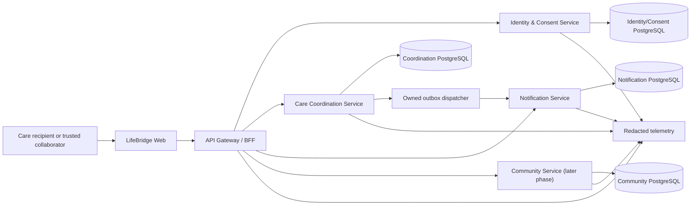

# LifeBridge Architecture

## P7-S2 durable event recovery boundary

The transport remains brokerless: Care claims its PostgreSQL outbox and calls
Notification through authenticated HTTP. Claim tokens and CAS fence stale
workers; lower active aggregate versions block higher claims. Notification
serializes event/aggregate processing, preserves immutable payload hashes and
rejects delayed older versions without overwriting durable results.

Care owns attempt history, terminal attention and replay audit. Notification
owns receipt/result evidence. Recovery compares bounded owner-local APIs by
event ID without datastore credentials or raw payloads. Community remains
`suppressed_not_configured`.

## P7-S1 owner migration boundary

`contracts/migrations/p7-s1-owner-ledger.json` is the machine authority for
four owner databases, table namespaces, exact migrations/tools, credential
identifiers and N-1/N windows. Node services share only a technical runner;
Community retains Flyway. Production artifacts require distinct runtime and
migration credentials. P7 changes are expand-only; contraction waits for
evidenced N-1 retirement and is not implemented here.

## Document status

- Architecture baseline: `ARCH-2026-07-25`
- Status: Accepted Phase 0 target architecture
- Runtime implementation status: P2-S1 backend candidate; production UI blocked
- Current phase: P2 — Trust and household
- Active implementation slice: `P2-S1`
- Production-maturity plan: `PLAN-2026-07-26-PRODUCTION` (`P0`–`P12`)

“Planned” below describes the approved target. “Actual” records repository/runtime evidence. Update both when implementation differs; do not rewrite the plan retroactively.

## 1. Architectural drivers

1. Deliver one reliable, user-visible vertical slice before broad platform scope.
2. Enforce household, role, and consent boundaries without a shared database shortcut.
3. Keep task completion durable even when notification delivery is delayed.
4. Run a deterministic synthetic demo without private credentials.
5. Support Windows bootstrap, test, build, and fresh-worktree reproduction.
6. Keep polyglot microservice boundaries practical for a small team while remaining independently runnable and deployable.
7. Make accessibility, privacy, auditability, and truthful state part of each contract.
8. Avoid operational complexity unless an access pattern proves it is needed.

## 2. Planned system context



No arrow represents direct access to another service's tables. The BFF composes APIs; it does not own domain records.

## 3. Planned versus actual

| Area                   | Planned baseline                                                         | Actual evidence at Phase 0                            |
| ---------------------- | ------------------------------------------------------------------------ | ----------------------------------------------------- |
| Workspace              | Polyglot microservice repository; runtime tooling is boundary-owned      | Node.js/pnpm services exist; no Java files/toolchain  |
| Web                    | Next.js + React, semantic components, localization                       | VI/EN routes and Stitch-derived states implemented    |
| Gateway/BFF            | Fastify, external HTTP contract, response composition                    | Public forwarding and honest degradation implemented  |
| Domain services        | Independently runnable, boundary-owned runtime artifacts                 | Node Gateway, Identity, Care and Notification exist   |
| Contracts              | Language-neutral OpenAPI/JSON Schema; versioned event envelope           | Executable TypeScript/Zod P1/P2 schemas exist         |
| Persistence            | PostgreSQL, separately owned database/schema per service                 | Two local/CI owner databases selected; migrations due |
| Cross-service delivery | Transactional outbox + versioned internal delivery + inbox/deduplication | Completion outbox/HTTP retry/inbox implemented        |
| Testing                | Vitest unit/contract/integration; Playwright browser smoke               | P1 Level C command and exact-head CI specified        |
| UI design              | Google Stitch MCP reference + reviewed repository handoff                | P1-S1 handoff frozen after native correction mapping  |
| Deployment             | Containerized services with health/readiness checks                      | Deferred until deployable slices exist                |

Any divergence requires a Change ID and, when architectural, an ADR.

### Accepted polyglot direction

`CHG-2026-011`/ADR-019 accepts Community as the first Spring Boot bounded
service, implemented at P5-S1/issue #15 and available for separately governed
extension through P5-S2/P5-S3.
Gateway, Identity & Consent, Care Coordination, and Notification are not
rewrite candidates for satisfying this requirement.

Community will own its PostgreSQL database, role, migrations, transactional
outbox, and audit. Node Gateway communicates with it only through versioned
language-neutral OpenAPI/JSON Schema contracts with provider/consumer tests.
Identity & Consent remains the authority; Community receives only authorized
minimum context and never another service's database credential or business
implementation.

P5-S1 starts directory search on Community-owned PostgreSQL. Elasticsearch,
Redis, a broker, object storage, or another engine requires a later accepted
ADR backed by measured access-pattern evidence. The completed official-source
P5-S1 gate pins Temurin 25.0.3+9, Spring Boot 4.1.0, Maven 3.9.16, Maven
Wrapper 3.3.4, explicit plugins and checksums under the repository-owned
Windows bootstrap.

## 4. Repository topology

Target topology:

```text
apps/
  web/                       # Next.js user interface
  gateway/                   # External API/BFF and composition
services/
  identity-consent/          # Identity, membership, role, consent
  care-coordination/         # Tasks, assignments, handoffs, care plans
  notification/              # In-app notification and delivery state
  community/                 # Help requests, directory, matching; later
packages/
  contracts/                 # Versioned HTTP/event schemas and generated types
  observability/             # Correlation, logging and metric primitives
  config/                    # Typed environment validation
  test-fixtures/             # Deterministic synthetic builders only
data/
  fixtures/                  # Reviewed fixture bundles and provenance
docs/
scripts/
```

Shared packages may provide technical primitives and schemas. They must not become a shared domain layer that lets services bypass ownership.

The actual repository map is authoritative for paths that currently exist: `docs/REPOSITORY_MAP.md`.

## 5. Service boundaries

### Web

Responsibilities:

- accessible, responsive presentation;
- client-side interaction and safe input preservation;
- localization;
- truthful rendering of confirmed, queued, failed, denied, stale, and conflict states.

It does not embed service credentials, infer permissions, or treat optimistic state as confirmed.

### API Gateway / BFF

Responsibilities:

- authenticate external requests and propagate actor/correlation context;
- enforce request size/rate boundaries;
- validate external schemas;
- route commands to the owning service;
- compose dashboard reads without cross-service database access;
- normalize safe client-facing errors.

It does not own task, identity, consent, or notification records.

### Identity & Consent

Responsibilities:

- account identity and authentication;
- household membership and roles;
- invitation lifecycle;
- care-recipient sharing/consent grants and revocation;
- authorization decision inputs and audit evidence.

Phase 1 may use a deterministic fixture adapter for an explicitly local demo. Real authentication and consent persistence begin in Phase 2. Fixture identity cannot be enabled in public production.

### Care Coordination

Responsibilities:

- care task lifecycle and assignment;
- timeline/handoff, calendar, care plan, and later care coordination features;
- authorization using trusted actor/grant context;
- optimistic concurrency and idempotent commands;
- atomic domain mutation and outbox append.

It owns task and coordination records. It never writes notification tables.

### Notification

Responsibilities:

- consume versioned events idempotently;
- render safe message keys/parameters;
- persist in-app notification/read state;
- manage channel delivery state and retries when channels are added;
- expose recipient-scoped reads.

It owns notification and inbox/deduplication records. A task can be durably completed even while notification is pending or failed.

### Community

Responsibilities:

- public/approved directory metadata;
- help requests;
- volunteer and organization matching;
- moderation case integration.

It receives only minimum-necessary consented data. It does not expose general household records.

Runtime: the repository's first Spring Boot service, introduced greenfield at
P5-S1 and extended rather than duplicated in P5-S2/P5-S3. Its accepted
repository-scoped toolchain is checksum-pinned Temurin 25.0.3+9, Maven 3.9.16
through Maven Wrapper 3.3.4, Spring Boot 4.1.0 and explicit build plugins.
P5-S1 implements only bounded help requests and public PostgreSQL directory
search; matching and moderation remain unstarted.

### Audit/read models

Each service first records its own security/business audit evidence. A consolidated audit-history read model may be added in Phase 2 through versioned events. It is read-only with respect to source domains and cannot become the authority for permissions or task state.

## 6. `P1-S1` interaction

```mermaid
sequenceDiagram
    actor User
    participant Web
    participant Gateway
    participant Care as Care Coordination
    participant CareDB as Coordination DB
    participant Dispatch as Outbox Dispatcher
    participant Notify as Notification
    participant NotifyDB as Notification DB

    User->>Web: Create and assign task
    Web->>Gateway: POST task + idempotency key
    Gateway->>Care: Validated command + actor/correlation
    Care->>CareDB: Commit task + create audit
    Care-->>Gateway: Confirmed task/version
    Gateway-->>Web: Created task
    User->>Web: Complete task
    Web->>Gateway: Complete task + expected version
    Gateway->>Care: Authorized idempotent command
    Care->>CareDB: Atomic completion + audit + one outbox
    Care-->>Web: Confirmed completion; delivery pending
    Dispatch->>CareDB: Read/claim owned outbox
    Dispatch->>Notify: Deliver versioned event
    Notify->>NotifyDB: Inbox dedupe + notification commit
    Notify-->>Dispatch: Durable acknowledgement
    Dispatch->>CareDB: Mark event delivered
    Web->>Gateway: Refresh dashboard/notifications
    Gateway->>Care: Read task summary
    Gateway->>Notify: Read recipient notifications
    Gateway-->>Web: Composed confirmed state
```

The dispatcher belongs to Care Coordination and reads only its owned outbox. It calls an internal Notification contract. Notification never polls or joins the coordination database.

`CHG-2026-008` freezes the accountable audience. The primary fixture has Lan
create/coordinate and Minh receive/complete. Completion targets Lan rather than
notifying the actor who just completed the work. Care resolves the event
disposition to `deliver` or `suppress_self`; Notification durably deduplicates
both and stores no self-notification. Create/assignment produces no P1
notification.

Care owns pending, retry, and terminal-failure delivery intent. Notification
owns inbox results and stored notification rows. The BFF may compose both
sources but cannot turn an outbox record into a fake Notification row. If
Notification commits and Care crashes before acknowledgement, event-ID
deduplication makes redelivery safe and the durable notification wins over the
stale Care projection.

An external broker may replace the initial transport later without changing domain event meaning. That change requires load/reliability evidence, an ADR, migration/rollback, and updated validation.

## 7. Contracts

### HTTP

- Validate at gateway and service boundaries.
- Publish versioned language-neutral OpenAPI/JSON Schema contracts and run
  provider/consumer compatibility tests across Node and Spring boundaries.
- Use opaque IDs, explicit timestamps/time zones, and bounded strings/lists.
- Require an idempotency key for create and state-transition commands.
- Require an expected entity version for concurrent updates.
- Return stable error codes with safe messages and correlation IDs.
- Never expose stack traces, database names, secret values, or protected-resource existence.

### Events

Minimum envelope:

```text
eventId
eventType
eventVersion
occurredAt
producer
aggregateId
aggregateVersion
correlationId
causationId
payload
```

Rules:

- event IDs are globally unique;
- consumers store source event IDs for deduplication;
- additive compatible changes preserve version;
- semantic/breaking changes create a new event version;
- payloads contain minimum necessary identifiers and message parameters, not care notes;
- retry has bounded backoff and a visible terminal/attention state;
- contract fixtures prove old supported versions remain consumable.

## 8. Persistence and service ownership

### Default

PostgreSQL is the default engine to minimize Phase 0/1 operational burden. Each service owns a distinct database or schema and credentials with access only to that boundary.

Absolute rules:

- no cross-service table writes;
- no shared table ownership;
- no direct cross-service SQL joins;
- no foreign key spanning service stores;
- no consumer reading another service's outbox;
- APIs/events are the integration boundary;
- backups and migrations are tested per owner.

A shared PostgreSQL server is acceptable locally if logical ownership and credentials remain separate. “Same server” must never become “shared database ownership.”

### Polyglot persistence

Polyglot persistence is permitted, not required. A new engine needs an accepted ADR with:

1. business/technical objective and measured access pattern;
2. owning service/team;
3. source-of-truth and consistency model;
4. backup, restore, disaster-recovery test, and RPO/RTO expectations;
5. retention, deletion, export, and legal/privacy implications;
6. migration/backfill, dual-read/write risk, rollback, and exit plan;
7. operational cost, local/CI support, monitoring, and failure modes;
8. security, encryption, credential, and tenant/household isolation;
9. planned versus actual rollout evidence.

Potential examples, not approved implementations:

- object storage for encrypted document blobs while document metadata remains service-owned;
- a rebuildable search index for a public/community directory;
- Redis for bounded cache/rate-limit/idempotency acceleration, never authoritative state.

Do not add an engine only because a microservice exists.

## 9. Consistency and failure behavior

| Operation              | Consistency                                                       | Failure behavior                                                   |
| ---------------------- | ----------------------------------------------------------------- | ------------------------------------------------------------------ |
| Create/assign task     | Strong within Coordination                                        | Reject invalid/unauthorized request; idempotent retry              |
| Complete task + outbox | One local transaction                                             | Task and event commit together or neither commits                  |
| Notification creation  | Eventually consistent across services                             | Completion remains true; delivery shows pending/failed and retries |
| Dashboard composition  | Read-your-confirmed-write for task; bounded eventual notification | Return task section even if notification is partially unavailable  |
| Consent revocation     | Strong in Identity/Consent; propagated invalidation               | Deny new access; reconcile cached/read models and audit            |
| Search index (future)  | Rebuildable eventual view                                         | Fall back to owner API/limited mode; never become authority        |

Commands are not retried blindly after an unknown result; clients reuse the same idempotency key and reconcile against confirmed state.

## 10. Security, privacy, and consent

- Trust boundaries exist at browser, gateway, service, datastore, MCP, and external-provider edges.
- Production authentication and service-to-service authorization are mandatory before public deployment.
- Authorization is checked by the owning service with actor, household, role, and consent context.
- Least-privilege database credentials map to one service boundary.
- Encryption in transit is required outside isolated local development; sensitive storage requires encryption and retention controls.
- Logs/events use stable IDs and result categories, not task descriptions, medication details, contacts, document names, or tokens.
- Every invitation, role, consent, document, emergency-plan, export, privileged read, and destructive action is auditable as its phase arrives.
- Fixture mode uses fabricated names/content and is disabled in public production.
- Secrets are loaded from runtime environment/approved secret stores and validated at startup.

Threat analysis and response procedures belong in `docs/SECURITY.md`.

## 11. UI architecture and Stitch

Google Stitch MCP provides design concepts and responsive references. Git remains the production source of truth.

Required gate:

```text
product flow
-> API/permission/state contract
-> Stitch concept
-> accessibility/privacy/security/implementation review
-> frozen handoff
-> React component implementation
-> browser and accessibility validation
```

Generated markup and scripts are never copied directly. Approved concepts are normalized into semantic components, tokens, localization keys, responsive rules, and tests.

For `P1-S1`, the frozen handoff covers Dashboard (`LB-011`), Task Board
(`LB-013`), Task Detail (`LB-014`), the applicable Notification state
(`LB-019`), and reusable state patterns. The implementation must trace routes
and tests to those aliases and record any accessible divergence.

## 12. Observability and safe operations

Every request/event propagates a correlation ID. Structured telemetry may include:

- service, route/operation, result code, duration;
- actor/household/task opaque IDs when necessary and policy-approved;
- event type/version, outbox age, attempt count, consumer result;
- dependency health and readiness.

It must exclude secret values, authorization headers, free-form care content, contact details, full payloads, and personal browser/session artifacts.

Health model:

- liveness: process can continue;
- readiness: required owned datastore/migrations/config are ready;
- dependency status: separately reported so a notification outage does not falsely mark coordination state absent.

## 13. Build, test, and deployment boundaries

- Node.js 22.x and pnpm 11.9.0 are the baseline.
- Each application/service exposes scoped format, lint, type-check, unit, contract, build, and start commands.
- Integration tests materialize isolated owned stores and deterministic fixtures.
- Browser tests use production-like service contracts, not UI-only mocks for the primary flow.
- Containers are built per deployable; local Compose is orchestration, not a shared service boundary.
- Database migrations run per owner with forward/rollback or documented recovery.
- Phase/release validation occurs before promotion `dev -> test -> main`.

Docker availability is an environment concern. The doctor reports daemon/config issues without changing Windows services, Registry, firewall, Docker settings, or privileges.

## 14. Production architecture maturity

Production architecture is accumulated and evidenced in stages:

| Phase | Architecture proof                                                                                                                                                                 |
| ----- | ---------------------------------------------------------------------------------------------------------------------------------------------------------------------------------- |
| P1–P5 | Each product slice owns authorization, data, events, errors, telemetry, accessibility, and rollback applicable to its path                                                         |
| P6    | Mixed Node/Spring version compatibility, independent artifacts/upgrades, dependency isolation, health/readiness, observability, SBOM/supply-chain, container and rollback evidence |
| P7    | Owner-scoped migrations, replay/reconciliation, backup/restore, retention/deletion, and polyglot exit plans                                                                        |
| P8    | Household isolation, consent enforcement, secret/encryption boundaries, artifact provenance, and abuse/privacy response                                                            |
| P9    | Redacted end-to-end telemetry, SLO/error budget, actionable alerts, truthful degradation, incident and DR rehearsal                                                                |
| P10   | Representative workload budgets, backpressure, bounded resources, scale correctness, capacity, and cost                                                                            |
| P11   | Immutable deployment, protected environments, staged rollout, rollback, pilot, and released artifact evidence                                                                      |
| P12   | Operational ownership, patch/rotation/restore cadence, post-incident learning, and governed successor architecture                                                                 |

Later proof phases do not excuse an earlier slice from an applicable control.
No end-to-end demo is itself evidence that the system is production-ready.

## 15. Architecture fitness checks

At each slice/phase gate, verify:

- no service imports another service's business implementation;
- no connection string grants cross-service write access;
- contract compatibility and invalid payload tests pass;
- task/outbox atomicity and inbox deduplication are tested;
- duplicate commands/events are harmless;
- dashboard partial failure is truthful;
- logs and event fixtures contain no sensitive content;
- fixture identity cannot be enabled in a production configuration;
- design handoff and accessibility evidence exist for UI changes;
- planned versus actual technology is current.

## 16. P6-S1 rolling contract boundary

Gateway and Spring Community share only language-neutral contracts. Current
Gateway can emit `community-v1` or `community-v2`; current Community serves
both. Rollout expands Community first, keeps Gateway on previous wire until
provider convergence, then activates current. Rollback switches Gateway back
first and removes no schema or data. Identity remains authority and Community
retains exclusive PostgreSQL/Flyway/audit/outbox ownership. P6-S1 adds no
migration, cross-service credential, shared business source, or generated
business code.

## 16. Change process

An architecture change requires:

1. Change ID in `docs/IMPLEMENTATION_PLAN.md`;
2. ADR in `docs/DECISIONS.md`;
3. planned versus actual topology/data/contract update here;
4. integration impact in `docs/INTEGRATION_LOG.md`;
5. task/dependency update in `docs/WORKSTREAM_BOARD.md`;
6. validation, migration, rollback, and follow-up evidence in `docs/SESSION_LOG.md`.

No datastore, broker, auth provider, deployment platform, service split/merge, cross-service contract, or public trust-boundary change is accepted only through conversation.

## 17. P2-S1 Identity & Consent architecture

`CHG-2026-010`/ADR-018 moves Identity & Consent from a planned boundary to an
owned backend slice. It uses its own `lifebridge_identity` PostgreSQL database
on the existing engine and exposes versioned internal account/challenge/session
operations to Gateway. No external IdP, JWT, Redis, broker, email/SMS delivery,
or additional engine is selected.

```text
browser
  -> gateway (cookie, Origin/Fetch Metadata, CSRF, strips actor headers)
      -> identity-consent (credentials, challenges, sessions, preferences)
          -> lifebridge_identity PostgreSQL

account session -X-> Care / Notification household data
                   (membership is not created until P2-S2)
```

The browser never selects an internal actor. Gateway resolves an opaque account
from Identity for account routes; household routes remain denied because
authentication is not membership authorization. P1 fixture headers remain an
explicit loopback-only compatibility adapter and any public/production
combination fails configuration.

Opaque pre-authentication challenges and authorized sessions use different
random tokens and tables. Successful factor, recovery, and onboarding
transitions rotate/revoke rather than promote a client-supplied identifier.
Identity owns audit facts atomically with relevant credential/session changes.
The exact security/data/API contracts live in
`docs/security/P2_S1_THREAT_MODEL.md`, `docs/DATA_MODEL.md`, and
`docs/API_CONTRACTS.md`.

The `LB-001`–`LB-007` gate remains requirement → permission contract → Stitch
reference → reviews → Frozen handoffs → implementation. The official synthetic
references and redacted handoff are now Frozen, and native Next.js routes
connect to the existing Gateway/Identity boundary. Full P2-S1 acceptance still
requires the single Level C and exact-head hosted CI.

## 18. P2-S2 household authorization ownership

P2-S2 extends the existing Identity & Consent authority and its
`lifebridge_identity` PostgreSQL database. It does not add a service, datastore,
shared table owner, cross-service credential or business-code import, so no new
ADR is required.

```text
verified account session
  -> Gateway (cookie, CSRF, Origin/Fetch Metadata, idempotency)
      -> Identity & Consent
          -> households + memberships
          -> digest-only bounded invitations
          -> minimum recipient context
          -> authorization audit evidence
```

Authentication alone grants no household capability. Every protected lookup is
membership/capability checked and uses the same generic inaccessible response
for absent and unauthorized resources. Invitation acceptance is the only path
in this slice that grants collaborator membership; organizer status originates
only from atomic household creation. Recipient context remains orientation
metadata, not a clinical record, legal authority or consent grant. Granular
consent remains P2-S3 and is not inferred from organizer membership.

## 19. P2-S3 consent authority and redacted history

P2-S3 extends the same Identity & Consent boundary and PostgreSQL datastore.
It adds no service, engine, cross-service SQL, shared writer, credential
coupling, or generated Stitch source.

```text
authenticated account + CSRF
  -> Gateway (origin/fetch-metadata, strips actor headers)
      -> Identity & Consent
          -> explicit subject authority
          -> versioned current consent grants
          -> immutable transitions + transactional outbox
          -> governed recipient-context authorization
          -> atomic privacy preferences
          -> redacted read-only audit history
```

An organizer can create household orientation context but does not thereby
become its care-recipient subject. Self-binding requires an explicit command
and creator provenance; legacy unproven contexts cannot be claimed or
backfilled. Once bound, every non-subject recipient-context read is evaluated
against the current Identity-owned consent grant at decision time. Outbox
events provide integration evidence but are never the authorization source.

The audit model is a privacy projection, not a raw log viewer. It is
subject-authorized, bounded, cursor-paginated, redacted, and exposes no totals.
Operational telemetry remains independently allow-listed and contains no
business values. Additive migration `003` is compatible with the `002`
runtime; application rollback leaves the new schema dormant and recovery is
roll-forward rather than destructive table removal.

## P3-S1 governed timeline and accountable handoff

P3-S1 extends the existing Care Coordination boundary; it does not add a
service, broker, database, or authority cache.

```text
browser
  -> Gateway normalizes the timeline/read or handoff intent
      -> Identity & Consent issues a fresh purpose-scoped P2 decision
          -> Gateway relays decision + exact normalized intent
              -> Care Coordination independently validates task scope/state
                  -> owned PostgreSQL transaction
                     task assignee/version
                     + handoff evidence
                     + immutable timeline fact
                     + audit
                     + outbox
                     + digest-only idempotency response
                  -> Notification consumes versioned outbox event idempotently
```

The browser never selects authority. Identity re-evaluates current membership,
subject/grant and privacy versions; organizer/member status is insufficient.
Gateway may compose but never fabricate an authoritative empty timeline or
successful handoff. Care accepts a decision only when permission, household,
correlation, request digest, and short server-time window match, then checks
recipient context, current assignee, open state, version, and eligible target.

The daily projection is a bounded accepted-state read model, not a raw audit
log. PostgreSQL derives each local-date `[start, end)` boundary from a
validated IANA zone. UTC occurrence plus `event_ref` is the stable public
order; an internal identity sequence freezes the snapshot against later
inserts and backward-clock facts. The HMAC-sealed keyset cursor binds viewer,
household, recipient, P2 versions, date, zone, filter, limit, snapshot,
continuation, and expiry. No total or hidden count is exposed.

Handoff occurrence/effective time is server UTC and immediate only after
commit. Its context is an enumerated reason, never free-form text. A 5xx after
submission remains uncertain until current task state is re-read; offline mode
is read-only and never queues mutation. The full control is
`docs/security/P3_S1_THREAT_MODEL.md`.

## P3-S2 governed calendar and appointment coordination

P3-S2 extends the accepted boundaries without adding a service, engine,
cross-service SQL path, credential or shared datastore owner:

```text
native LB-015/LB-016
  -> Gateway session/CSRF/origin boundary
    -> Identity fresh action/request-digest decision
      -> Care appointment command or calendar projection
        -> Care-owned PostgreSQL transaction
          -> structured reminder-intent outbox
            -> Notification-owned inbox/reminder intent
```

Identity & Consent owns the current subject, grant, privacy and action-specific
decision. The existing P2 `household_coordination` basic-label grant maps to
P3-S2 only through `P3-S2-v1`; organizer/member/caregiver role remains
insufficient. Care verifies the decision again and owns structured appointment
kind/logistics, finite occurrence materialization, conflict serialization,
optimistic version, cancellation history, audit, idempotency and outbox.
Gateway normalizes and composes only. Notification receives and owns one
minimum structured schedule/cancel intent and makes no delivery claim.

Server-confirmed UTC, source local time, numeric offset and validated IANA zone
are separate contract facts. DST gaps fail; overlaps use an explicit
earlier/later policy. Weekly recurrence is finite and materialized, so
confirmed occurrence UTC instants do not silently move when runtime time-zone
data changes. V1 change/cancel scope is one occurrence only; series surgery,
arbitrary RRULEs and external calendar synchronization remain non-goals.

The calendar and agenda use one lossless Care projection ordered by UTC start
and opaque appointment ID. Unavailable dependencies cannot become an empty
calendar, conflicting writes cannot overwrite silently, cancellation cannot
delete history, and a mutation transport failure cannot become optimistic
success or blind retry. The full control is
`docs/security/P3_S2_THREAT_MODEL.md`.

## P3-S3 governed versioned support plan

P3-S3 extends Care Coordination and its owned PostgreSQL only. Identity &
Consent issues a fresh `read`, `history.read`, `draft.save`, or
`version.confirm` decision bound to request digest and current P2 versions;
Gateway relays and composes only. Care rejects wrong/stale/future authority,
validates responsibility targets, serializes the one shared draft/current
aggregate, and appends immutable confirmed versions. Save/confirm use expected
aggregate/draft/base counters and digest-bound 24-hour idempotency.

Confirmation atomically advances current, removes the working draft, preserves
all prior versions, writes content-free transition/audit/replay evidence, and
stores `care.care_plan.version_confirmed.v1` as suppressed no-delivery outbox
evidence. Plan statements and actor references never enter cross-service
events, Notification, telemetry, cursors, errors, or audit metadata. Local
review dates keep validated IANA zones and stored server-resolved half-open UTC
day bounds. History is reverse-version ordered with sealed bounded cursors and
no totals. No service, engine, shared database, cross-service SQL, or reminder
path is introduced.

## P4-S1 medication reminder ownership

P4-S1 extends accepted services and PostgreSQL ownership; it introduces no new
service or persistence engine.

- Identity & Consent alone evaluates fresh exact-purpose P2 authority for each
  schedule read/create/change/disable and Notification read/acknowledge.
- Care Coordination alone owns reminder definitions, finite materialized
  occurrences, lifecycle/version transitions, redacted audit, digest-only
  idempotency and schedule/cancel outbox intents.
- Notification alone owns received structured intents, delivery attempts,
  authoritative in-app item evidence, generic reminder projections,
  immutable seen acknowledgements, redacted audit, idempotency and
  acknowledgement outbox evidence.
- Gateway strips caller-supplied actor/service headers, binds the complete
  normalized intent digest, obtains a fresh decision and composes only
  authoritative owner responses. It stores no reminder state and never treats
  an intent receipt as delivery.

Care never writes Notification tables and Notification never reads or writes
Care tables. The event boundary contains opaque scope/recipient identifiers,
occurrence identity/version, trigger UTC and source local/IANA/offset facts plus
a fixed message key. Medication label, amount and unit stay in Care because
they are not necessary to deliver a generic reminder. Cross-service SQL,
credentials, imports, shared ownership, synchronous dual writes and fabricated
Gateway state are forbidden.

The Notification in-app due processor uses server time and an injected clock in
tests. Before the trigger it remains pending. Inside the bounded delivery
window, an atomically stored in-app item is authoritative delivered evidence.
At the window boundary without such evidence it becomes missed; explicit
attempt failure or indeterminate integration result remains failed or
uncertain. Retry/reconciliation reuses the same intent identity. Acknowledgement
is a separate Notification transaction permitted only after delivered evidence
and records only that the reminder was seen.

## P4-S2 emergency readiness and bounded offline ownership

P4-S2 extends Care Coordination and the existing Care PostgreSQL owner; it
introduces no server service, datastore, broker, cross-service SQL, shared
credential, Gateway state, or Notification path.

- Identity & Consent alone evaluates a fresh `P4-S2-v1` exact-purpose decision
  for every online contacts, plan, history, and snapshot operation. Household
  role never substitutes for subject/grant/privacy authority.
- Care Coordination alone owns the emergency-readiness aggregate, minimum
  contact projection, shared draft, immutable participant-reviewed versions,
  optimistic revisions, redacted audit, digest-only idempotency, content-free
  transitions/outbox, and one version-consistent snapshot projection.
- Gateway strips caller-supplied actor/service/authority headers, binds the
  complete normalized request digest, obtains a fresh Identity decision, and
  stores no emergency state.
- Notification receives no emergency event or content. P4-S2 never contacts a
  person, diagnoses, ranks urgency, treats, confirms availability, or
  dispatches an emergency service.

All contact and plan mutations serialize on the same Care aggregate. A contact
replacement advances its list revision and invalidates offline issuance until
the participant reviews a new plan version against that exact revision. The
snapshot endpoint reads the reviewed plan, current contacts, source revisions,
and server confirmation/display-time facts in one transaction. It cannot
fabricate live state, current permission, or external-contact consent.

ADR-025 creates one narrow client-side exception to the default no-persistent-
care-data rule. After a separate explicit device review, the browser derives a
non-exportable AES-256-GCM key with PBKDF2-HMAC-SHA-256 and 600,000 iterations
from a distinct offline passphrase, unique 16-byte salt, and unique 12-byte
nonce. It stores one authenticated ciphertext in IndexedDB. The passphrase and
derived key are never sent, logged, persisted, or given to the worker. A
same-origin service worker with route-bounded behavior caches only versioned
static shell assets and never API/session/mutation responses or protected HTML.

Every offline render labels the snapshot not live, includes the server
last-confirmed UTC plus local/IANA/offset facts, and states that current
permission and updates cannot be checked. The reading window is recent through
24 hours and stale through 72 hours. At 72 hours content is hidden and the
ciphertext is purged. Unknown/backward time never appears recent. Local removal
requires no server. On reconnect, current authority and source versions are
checked before replacement; writes remain blocked and no request is queued or
replayed.

## P4-S3 bounded document-vault ownership

P4-S3 extends existing owners only. Care Coordination owns bounded document
metadata and bytes in its PostgreSQL database. Identity & Consent owns the
fresh `P4-S3-v1` exact-purpose decision. Gateway composes authorization with
Care and streams bounded attachment responses but owns no document, locator,
authority, audit, retry or processing fact. Notification is uninvolved.

The browser sends one bounded JSON/base64 upload through Gateway; Care alone
decodes, validates strict UTF-8 `.txt` content, hashes, binds and commits it.
No object store, scanner service, crypto scheme, cache, broker or new runtime
is added. A successful object is explicitly `ready_unscanned` with no clean
claim. Every metadata read and download performs another current P2 decision,
then Care verifies the owner-local object binding and digest before returning
an attachment-only response.

Browser storage is outside the document data plane: no service worker,
Cache Storage, IndexedDB, localStorage or sessionStorage contains document
bytes or metadata. XHR progress is transport evidence only. Cancelled, timed
out or uncertain mutations reconcile through a new authorized projection and
the same upload/idempotency identity. Offline mode has no authority, copy,
queue, replay or automatic submit.

Logical dump/restore is scoped to the Care owner and tests pre-delete byte/
binding recovery plus post-delete non-resurrection. It does not establish
production encryption, historical-backup retirement or RPO/RTO. Those remain
deployment gates.

## P5-S1 Spring Community boundary

P5-S1 realizes ADR-019 without rewriting an accepted Node service:

```text
native LB-024 public directory
  -> Node Gateway identity-free public route
    -> Spring Community structured PostgreSQL search

native LB-022 protected request
  -> Node Gateway session/origin/CSRF boundary
    -> fresh Identity community_support decision
      -> Spring Community decision revalidation
        -> Community-owned PostgreSQL transaction
          -> request + audit + idempotency + suppressed outbox
```

Community is one greenfield Spring Boot service and the sole owner of its
PostgreSQL role/database, Flyway migration V1, directory/search indexes,
request aggregates, replay/tombstone evidence, audit and transactional outbox.
Gateway stores no Community fact. Identity remains the only consent/subject/
grant authority. Care and Notification receive no Community call, event,
credential or table access in P5-S1.

Gateway normalizes the Identity boundary rather than leaking its internal
errors: exact Community revocation maps to `COMMUNITY_CONSENT_REVOKED`, other
non-enumerating authority failures map to `COMMUNITY_AUTHORITY_REQUIRED`, and
dependency/contract failures map to `IDENTITY_SERVICE_UNAVAILABLE`.

The Node/Spring boundary is the frozen language-neutral
`contracts/community/p5-s1-v1` OpenAPI/JSON Schema tree. Both runtimes verify
its recorded hashes and the same fixed canonical request-digest vectors.
Business ownership and generated SDK/source are not shared. Protected calls
carry only the minimum fresh ten-second decision projection; public directory
calls carry no Identity or household context.

PostgreSQL is the only search engine. Filters are structured and allowlisted,
results are bounded/deterministic, and provenance freshness is stored owner
data. No Redis, Elasticsearch, broker, object storage, new cache/storage/
crypto engine or second Community service is introduced. Gateway's five-
minute public response cache and the browser's identity-free 24-hour
`sessionStorage` fallback do not contain protected request state.

Community serializes first-use idempotency keys and duplicate boundaries with
transaction-scoped PostgreSQL advisory locks. Replay rows are aggregate-digest
linked and invalidated on explicit deletion or retention purge. A Community-
owned scheduled sweep uses row locks with `SKIP LOCKED` for the 30-day auto-
close and subsequent 30-day protected-field purge; audit/outbox versions remain
monotonic and outbox aggregate/version pairs are unique.

The service exposes separate `/health/live`, database/migration-aware
`/health/ready` and `/version` endpoints. The accepted repository toolchain is
checksum-pinned Temurin 25.0.3+9, Maven 3.9.16 through Maven Wrapper 3.3.4 and
Spring Boot 4.1.0; it is process-local and does not alter the machine Java or
Maven configuration. The complete control is
`docs/security/P5_S1_THREAT_MODEL.md`.

The accepted slice has focused contract, owner-isolated migration, Spring
integration and built mixed-runtime browser evidence. The only full local
P5-S1 Level C invocation retained its static-format failure, and the guarded
same-ledger targeted continuation passed every previously unstarted gate plus
cleanup. A later review-driven hardening pass was validated only with
classified targeted Node, PostgreSQL, browser and reproducible-package proof;
it did not invoke a second full campaign. Final feature head
`59f57e903ad71342e3259fce48b9de3315e7adef` passed exact-head CI, PR #66
merged as `dev@ac663a714b69aace443f712f1d8ee700b5e48636`, and post-merge run
`30397698495` passed all required jobs and the aggregate gate.

## P5-S2 extension of the Community boundary

P5-S2 extends the accepted ADR-019 Spring Community service and its PostgreSQL
owner; it does not add a service or storage engine. Node Gateway remains the
browser/session/CSRF boundary, Identity & Consent remains authority, and
Gateway↔Community uses only frozen `P5-S2-v1` OpenAPI/JSON Schema. Identity
authority, Community organization approval/role and Community capacity are
three independent expiring/revocable evidence planes.

# P5-S3 extension

P5-S3 extends ADR-019's existing Spring Community boundary; it adds no service,
engine, broker, cache, or cross-service database access. Node Gateway performs
fresh P2 authority orchestration and schema validation only. Community remains
authoritative for redacted moderation cases and atomic resolution/audit/outbox
truth.

# P6-S2 deployable ownership contract

The deployable boundary is the six-entry inventory under `artifacts/`: Web,
Gateway, Identity & Consent, Care Coordination, Notification and Community.
Each manifest owns its entrypoint, allowed configuration, port, liveness,
readiness, database credential (if any), migrations, SBOM and container. Shared
packages may expose language-neutral contracts, configuration primitives and
redacted observability; deployables never import another deployable's source or
business package. A service runtime receives only its own database credential.

Gateway has API credentials but no datastore credential. Care's Notification
API token is an integration capability, not Notification datastore access.
Fitness tests fail closed on foreign database variables, cross-deployable source
imports, broad final-image copies or an incomplete owner inventory.

# P6-S3 authenticated dependency boundaries

ADR-028 makes each receiver authoritative for caller/audience/scope. Gateway
signs separately for its four dependencies; Care uses an independent
Notification event key, so Gateway cannot publish Care events. Provider
current/previous overlap permits consumer-first rollback without broadening
scope. Each dependency has its own timeout, byte ceilings, bulkhead and circuit.
Gateway probes required Care/Identity concurrently; Notification and Community
are truthful degraded states. Telemetry records only allow-listed dependency
and failure class, never URLs, headers, tokens, bodies or raw idempotency keys.

# P7-S3 lifecycle and recovery boundaries

Identity coordinates only opaque lifecycle request/status evidence. Identity,
Care, Notification and Community independently apply an owner-approved policy
to their own PostgreSQL store and expose owner-local result evidence; no
coordinator reads foreign tables or credentials. Missing policy or owner
evidence remains `attention_required` and never becomes a completion claim.

Recovery is likewise owner-local: one encrypted logical artifact and isolated
restore target per PostgreSQL owner. The encrypted emergency IndexedDB envelope
is a derived client copy with local delete/rebuild semantics, not a server
backup source. Runtime polyglot Node/Spring does not imply polyglot persistence.

# P8-S1 authorization overlay

P8-S1 adds no service or datastore. It routes the historical P1 protected
surface through the existing Gateway -> Identity -> owner topology. Identity
owns relationship/consent versions; Care/Notification own records and enforce
the exact decision immediately before access. Fixture-header identity is
accepted only under the existing local/test runtime guard. Recovery operator,
Gateway and event producer scopes remain distinct P6 identities.
